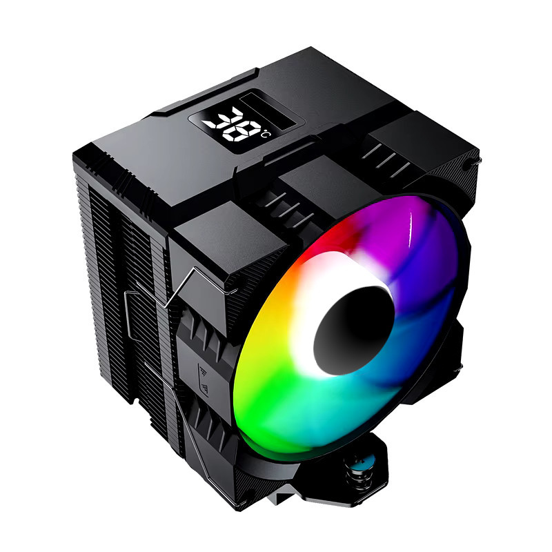

## PyCooler Digital Display

**PyCooler Digital Display** is a command-line tool that helps you deal with any digital display which does not have a driver on Linux system. Especially built-in digital display on CPU Cooler Tower or Water-cooler AIO. 

Don't scare of the "command-line" part. I'll walk you through very few steps to install this tool, deploy it and forget about it. The project is aiming to help everyone using Linux, which includes beginer, amateur or beyond. So the instruction looks a bit lengthy, but it is worth to explain every details so you don't need to go anywhere to find the answer.

If you are using Windows, you should go to manufacture's website to find device's driver.

**Table of Contents**

* [Requirements](#requirements)
* [Installation](#installation)
* [Find your Cooler's device_path](#find-your-coolers-device_path)
* [How to run with sudo permission](#how-to-run-with-sudo-permission)
* [Start PyCooler Digital Display automatically](#start-pycooler-digital-display-automatically)
* [List of supporting devices](#list-of-supporting-devices)
* [Adding support for your device](#adding-support-for-your-device)
* [Troubleshooting issues](#troubleshooting-issues)


### Requirements
1. You using Linux which has Python 3.10 or newer. Normally, Python is a default and pre-installed on Linux.
2. Your digital display is plugged into a USB interface. It could be USB A, USB C, mini USB, micro USB or USB header on the motherboard.

### Installation

(*Given commands here are in Ubuntu, other Linux distributions should have similar package managers. Google to find equivalent commands in your system.*)
1. Download code to your PC. Click the Releases link on the right panel of this page, download the zip file.

2. Locate the downloaded file. I suppose it is in your home directory `$HOME/Download`
```
cd ~/Download
# you may want to move it to another directory

unzip pycooler-digital-display-1.0.1.zip
cd pycooler-digital-display-1.0.1
```

3. Install required libraries
```shell

python -m pip install -r requirements.txt
```

**pip** is a default Python packages manager. If `pip` is missing, you can install `pip` by
```shell
sudo apt install python-pip
```

4. Test the installation
```shell
python app.py list
```
This `list` commad will show all the USB devices that plugged on your PC.

### Find your Cooler's `device_path`
First, you need to list all the USB devices on your PC
```shell
python app.py list
```

You should scan through the list to find your device which might come with the vendor, manufacture and device name.
But many (cheap) devices usually come up with all empty non-sense attributes. For example, this is my Cooler Tower's output
```
🔌  /dev/hidraw0 
   path :  b'/dev/hidraw0'
   vendor_id :  20785
   product_id :  8199
   serial_number :  
   release_number :  0
   manufacturer_string :  
   product_string :  
   usage_page :  65280
   usage :  1
   interface_number :  0
   bus_type :  1

```
But I know it is the cooler using the deductive reasoning method, as other devices show recognized names.



### How to run with `sudo` permission
Usually due to security reason, python code cannot modify a device that has not mounted properly (mount in the file system, not "mount" to the motherboard). You can still see the device path is `/dev/*`, is not something like `/mnt/*`.  
Especially in our case, you don't need to mount a Cooler to file system :D. So you would have to run python script with `sudo`. You don't need to follow steps bellow if you're a root user.

```shell
sudo -i $(which python) app.py COMMAND args --options
```

**Example**

```shell
sudo -i $(which python) app.py monitoring /dev/hidraw0 --update-interval 3
```
Now, check your cooler digital display to see if it shows temperature.

Congrats! YOU DID IT.

**Explain command components**

`sudo -i` runs sudo command and keeps environment variables and alL "environment settings" of current user

`$(which python)` return the path to excutable `python` in your current user

`app.py` are our Cooler Display program.

`monitoring` is the command. There are a few of them: list, test, monitoring, enable, disable

`/dev/hidraw0` is the `device_path` you found using `list` command.

### Start PyCooler Digital Display automatically
You want to set up this once and forget. It should start automatically everytime you turn on the PC.

```shell
sudo -i $(which python) app.py enable /your/device_path
```

### List of supporting devices
1. ✅Cooler tower GamerX Z1300
2. ❔Cooler tower DeepCool AK620/AK500/AK500S/AK400 Digital (need to verify)

### Adding support for your device
Thank your for reading until here. I'm sorry that I can not support for your device, but I only have 1 device, so you know. Anyone have some Python coding skill is more than welcome to fix the code and support new devices. The code is actually very simple. You'll find everything you need in two functions `monitoring()` and `ping()`. Check for more details document in **cython-hidapi** [document](https://trezor.github.io/cython-hidapi/index.html).

This tool use Typer for command-line interface. Check Typer's document [here](https://typer.tiangolo.com/tutorial/commands/). 

### Troubleshooting issues
Currently, I don't have any issue with this tool, so I cannot give you advices. But I foreseen some potentials issues. You're welcome to report issue on this repository.

1. **`hidapi` not found.** 

Install the lib for Ubuntu
```
sudo apt install libhidapi-dev libhidapi
```

2. `IOError` or hidapi sends wrong data format.

PyCooler Digital Display expects very simple digital display controller device that plugged in via USB interface. The the command `app.py monitoring` would send the temperature in a bytes array which is `[1, 47]`. **1** is the command to update value in the digital display controller. and **47** is the temperature it draws from Linux. So if your digital display has complicated combination of code, probably it won't work.

Please submit an Issue, and hope that someone has the same device will help you fix the code.

3. Service does not start automatically. Here are some useful commands to debug

```shell
sudo systemctl status cooler-display
sudo systemctl restart cooler-display
journalctl -u cooler-display --since today

# bonus command to fix permission issue
sudo chown root:root /etc/systemd/system/cooler-display.service
sudo chmod 644 /etc/systemd/system/cooler-display.service
sudo chmod +x app.py
sudo systemctl daemon-reload
sudo systemctl enable cooler-display
sudo systemctl start cooler-display

```

4. << to be added >>

